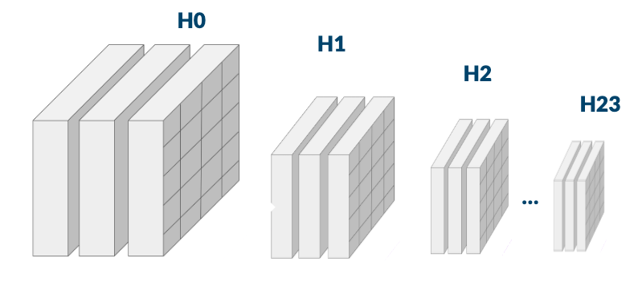
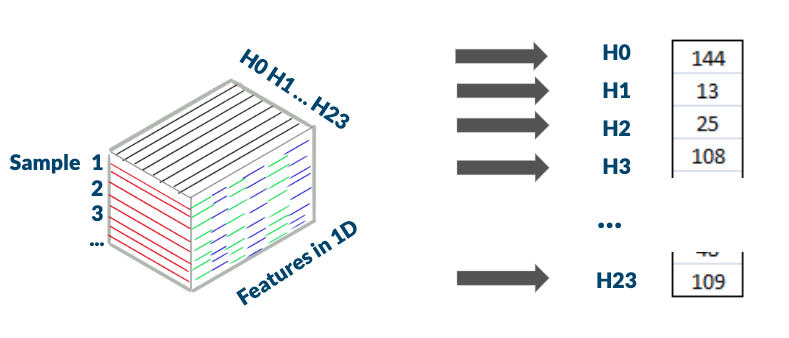
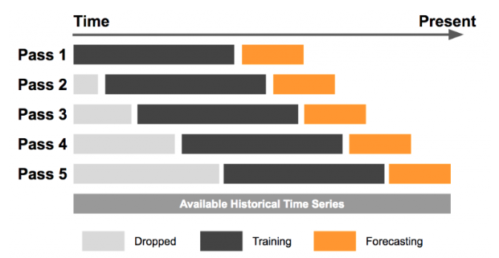

# Short-term-energy-demand-forecasting
This project is the final project repo for the [AkademyAi](akademy.ai) machine learning course. Investigates various models to predict short-term (24 hour advance) energy demands in the Spanish energy market.

[Watch the final project presentation](https://youtu.be/KaWCwBD_UBA) for this repo.

#### -- Project Status: [Completed]

## Problem Definition and Motivation
This project is inspired by the paper [Tackling Climate Change with Machine Learning](https://arxiv.org/abs/1906.05433) where forecasting is identified as one of the highest impact research areas to contributing to more renewable energy in the grid. Further, it explores the results from [here](https://www.researchgate.net/publication/330155110_Short-Term_Load_Forecasting_in_Smart_Grids_An_Intelligent_Modular_Approach) where the authors argue that traditional statistical forecasting is more computationally efficient compared to state of the art approaches. Finally, the last model draws from the data structure, and problem setup in the [following paper](https://www.researchgate.net/publication/323847484_Statistical_and_Machine_Learning_forecasting_methods_Concerns_and_ways_forward) to implement a state of the art Long Short Term Network forecast.

Energy demand forecasting is highly relevant to an effiecnt electrical grid. Improved forecasting is beneficial to deployment of renewable energy, planning for high/low load days, and reducing wastage from polluting on reseve standby generation (typically inefficent gas or coal fired powerplants).

##### Project objectives
1. Implement classical statistical forecasting models
2. Implement state of the art neural network forecasting models
3. Implement and gain insight into walk forward validation, forecasting performance, and feature selection. 

##### Problem summary
The specific problem addressed is to use past energy consumption data, day of the week, holidays, and weather data to once daily predict the next 24 hours of energy demand. This is a highly relevant problem carried out everyday by electrical grid Transmission Service Operators (TSOs) across the world. In order to appropriately meet energy demands TSOs issue energy demand forecasts once a day for the coming 24 hour period. The expected maxium energy demand is forecasted on an hourly basis and consists of 24 hourly slices. These forecasts are used in the planning of supply dispatch, for day-ahead bidding processes, and combined with ultrashort term (6 hours or less) forecasts that maintain balance in the grid. 

### Methods Used
* Data Wrangling
* Machine Learning
* Regression
* Neural Networks
* Predictive Modelling
* Walk forward cross validation
* Hypothesis Testing

### Technologies
* Python
* Keras, Tensorflow
* Pandas, Numpy, Jupyter
* Statsmodels, Scikit-Learn
* Prophet
* Joblib, holidays libraries
* Google Cloud Platform

## Project Description
This project compared forecasting capabilities of classical statistical models versus modern neural network implementations on a realistic task of short-term energy demand forecasting. The main question the projec asks is:

***What forecasting model and supervised learning problem formulation gives the lowest MAE given constrained computation power***

Timeseries forecasting models implemented in addressing this question are:
1. SARIMA - Seasonal Autoregressive Integrated Moving Average
2. Prophet General Additive Model by Facebook
3. Long-Short Term Memory Nerual Network

### Data sources
Energy data was obtained from the [ENTSOE Transparency Platform](https://transparency.entsoe.eu/). The platform provides electrical demand, generation, and price information for all european countries since 2015. Data is available at hourly and daily timeframes. 

Weather data was purchased from [OpenWeatherApi](https://openweathermap.org/api). Data from the five largest cities in spain was pruchased for the previous 8 years. Data includes hourly measurements of temperature (min, max), humidity, preciptation (1h, 3h), snow (1h, 3h), and general descrption of weather status (text format)

Day of the week and holiday data was genreated using the holidays library. The [following notebook](https://github.com/nicholasjhana/short-term-energy-demand-forecasting/blob/master/data_creation_day_types.ipynb) explains how the helper function was implemented. The helper function can be accessed from [make_holidays_data.py](https://github.com/nicholasjhana/short-term-energy-demand-forecasting/blob/master/make_holidays_data.py).

### Modelling Short-Term Energy Demand

Features used to generate forecasts include autocorrelated hourly energy consumption, hourly weather data, days of the week, and holidays. A detailed decrption of each feature is below:

- Energy demand lags ranging between 7 days (168 hours) and 1 month
- Two PCA vectors generated from weather data
- Days of the week one hot encoded
- Holidays one hot encoded

The output of each model was always the peak expected demand per hour for the next 24 hour period. This forecast was generated from 00:00 each day, over the course of the testing period (see cross validation).

### Supervised learning problem
Starting with a univariate sequence of hourly energy demand data points, a supervised learning problem was constructed by shifting data points in such that a previous timestep t-1 was used to predict t. An example of this shifting (also named lagging or lags) is presented in the table below.

##### Days shifted by x steps

| Date | t | t-1 | t-2 | t-3 |
|---|---|---|---|---|
| Day 1:| 0 | Nan | Nan | Nan |
| Day 2:| 1 | 0 | Nan | Nan |   
| Day 3:| 2 | 1 | 0 | Nan |
| Day 4:| 3 | 2 | 1 | 0 |
| Day 5:| 4 | 3 | 2 | 1 |
| Day 6:| 5 | 4 | 3 | 2 |
| Day 7:| 6 | 5 | 4 | 3 |

Two variants of this lagging was implemented. The SARIMA and Prophet models used direct lags following the linear sequence of data through time (i.e. to lag one complete day was 24 lags). The neural network used a different structure where one lag represented the same hourly segment, one day prior.

#### SARIMA & Prophet
The SARIMA and Prophet models construct the previous time steps by shifting the sequence of energy and weather data one hour at a time and output a sequence of 24 values corresponding with the next day's demand. The table below describes the learning problem's structure.

|Input Lagged Features||||||Outputs|
|-|-|-|-|-|-|-|
|30 Days prior | ... | 7 days prior |2 days prior | Previous day |>>> MODEL >>> | Forecast|
|h0...h24 | ... |h0...h24 | h0...h24 | h0...h24 | >>> MODEL >>> | h0 ... h24|

When combined together with may samples the structure of the problem takes on the following shape. Feature vectors are created by lagging the original sequence at different intervals. These vectors are stacked on top of one another by alinging similar lags. One 2D matrix of lagged features consitutes the data needed for a single day's forecast (one sample). The output as seen in the figure below is a row vector of the 24 hourly predictions.

#### LSTM
The LSTM problem framing was different from the SARIMA and Prophet. The feature input was the same, however the relationship between the shifted features was based on the assumption that each hour of the day had a stronger autocorreltion with the same hour a day prior than the hour prior. The structure of the supervised problem is seen in the table below. 

|I/O| date | h00 | h01 | ... | h23 |
|-|------|----|----|-----|-----|
|Lag features| 2015-12-01 | 21331.0 | 20622.0 | ... | 25101.0 |
|| ... | ... | ... | ... | ... |
|Lag features| 2016-01-01 | 22431.0 | 21632.0 | ... | 24000.0 |
|||⌄⌄⌄⌄⌄|⌄⌄⌄⌄⌄|⌄⌄⌄⌄⌄|⌄⌄⌄⌄⌄|
||LSTM-h0|LSTM-h1|...|LSTM-h23|
|| |⌄⌄⌄⌄⌄|⌄⌄⌄⌄⌄|⌄⌄⌄⌄⌄|⌄⌄⌄⌄⌄|
|Forecast| 2016-01-02 | 22113.0 | 20515.0 | ... | 26029.0 |

To formulte this problem using the same data processing as in the SARIMA and Prophet models you would arive at a single data structure per hourly output. In the graphic we see each hourly output has its own 3D input comprised of the lags (previous timestep data), features (energy, weather, day of week), and the sample day of forecast.

The result is computationally intensive for SARIMA and Prophet as you would need to implemente 24 models to solve the supervised learning problem. This implementation is also not feasible in terms of dimensionality with a neural network (LSTM doesn't accept 4D data).

The solution, as outlined in [one of the motivating papers](https://www.researchgate.net/publication/323847484_Statistical_and_Machine_Learning_forecasting_methods_Concerns_and_ways_forward) is to flatten the features and lags into a single vector. In this way each hourly segment has its own vector containing all the features at the set previous timesteps. The graphic below shows how the alternating green and blue lines represent the various features and lags compressed into a 1D vector.

### Cross validation descrption

Walk forward validation is a standard backtesting methodology when working with timeseries data. The method allows for the validation of test results and reduces overfitting to a small sample of data. The following graphic shows how the whole data set is broken into training and test segments. Once the model has been tested, the previous test segment is introduced into the training data and the model is retrained. Finally the model is tested again on the expanded dataset.

In this project the goal was to have a stadnard training window of 1 year, and a test window of 3 months. Within the training and test sets, a prediction was made once per calendar day. In practice however, this was too computatinoally intensive for the SARIMA, and prophet models given the resources of the project (2 weeks). The intervals were therefore reduced. 

## Project needs and core tasks

- data processing/cleaning
    - cleaning of energy data, weather data, and generation of holiday data
    - process data to generate autoregressive features
    - processing data to frame the problem for SARIMA, Prophet, LSTM
- data exploration
    - visualize energy consumption patterns at different temporal scales
    - visualize weather correlations and 
- statistical modeling
    - (auto)correlation analysis of model features and feature selection
    - PCA transformation of colinear (weather) features
    - parameter selection for SARIMA model: determining differncing, seasonality, and trend components
    - parameter selection for Prophet model: configure base mode, additional regressors
- machine learning
    - configuration, hyperparmeter tuning, training, and testing of LSTM neural network
- data pipeline
    - helper functions to prepare input, calcualte erros, run walk forward cross validation, and produce visualizations for each model
- reporting/presentation
    - documentation of helper functions
    - presentation of work at live event 

## Run these models yourself

Each model pipeline may be run independently. To replicate results, or build on this project, you can get started by:

1. Clone this repo
2. Raw data used for this project Data is found in CSV format within this repo [here](Repo folder containing raw data) within this repo.
    a. Updated energy data can be downloaded from the [ENTSOE Transparency Platform](https://transparency.entsoe.eu/)
    b. Weather data was obtained from the [OpenWeatherApi](https://openweathermap.org/api) and additional data may be purchased.
3. Follow the requirements.yml file to install dependencys
4. Data processing, transformation, and models are found in the main repo.
5. Executing any of the following files will run the designated model:
    a. model_sarima.py
    b. model_prophet.py
    c. model_lstm.py
6. Model output is saved in json for the SARIMA and LSTM. Prophet output is saved in csv.
7. Results folder stores the model outputs under their respective folder names.

## Featured Notebooks & Deliverables

#### Models
* [SARIMA](https://github.com/nicholasjhana/short-term-energy-demand-forecasting/blob/master/model_arima.ipynb)
* [Prophet](https://github.com/nicholasjhana/short-term-energy-demand-forecasting/blob/master/model_prophet.ipynb)
* [LSTM](https://github.com/nicholasjhana/short-term-energy-demand-forecasting/blob/master/model_lstm.ipynb)

#### Anlysis and Helper Functions
* [Feature Analysis Energy and Weather](https://github.com/nicholasjhana/short-term-energy-demand-forecasting/blob/master/data_analysis.ipynb)
* [Data window and transform functions](https://github.com/nicholasjhana/short-term-energy-demand-forecasting/blob/master/data_features_preprocessing.ipynb)

#### Communications
* [Presentation Deck](https://github.com/nicholasjhana/short-term-energy-demand-forecasting/blob/master/presentation-short-term-load-forecasting.pdf)
* [Presentation Video](https://youtu.be/KaWCwBD_UBA)
* [Blog Post](link)

## Contact

**Project lead: [Nicholas Shaw](https://github.com/nicholasjhana) nicholas at nicholasjhana.com**
